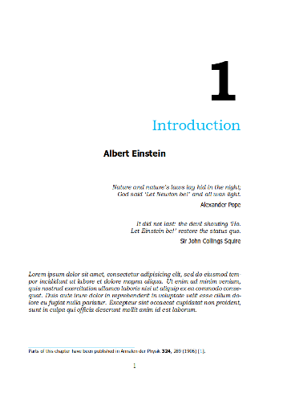
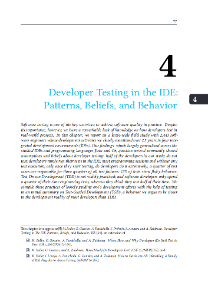
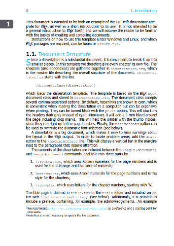
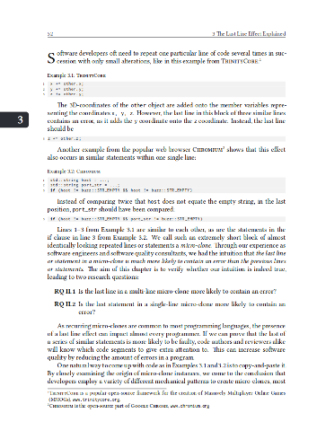

# Improved TU Delft PhD Thesis Template

This is an improved version of the [TU Delft PhD thesis
template](https://www.tudelft.nl/en/tu-delft-corporate-design/downloads/). It
features a large number of changes to increase both on- and off-screen
readability and quality, as well as reduce printing costs. It is a
double-sided, colored dissertation style with hyperlinks (although many of
these parameters can be easily changed).

## How to Pay Attribution

I did not create the original template. However, I would appreciate it
if you did keep the note that you are using this adopted version of
the template. Moreover, would you send me a message (moritzbeller -AT-
gmx -DOT- de) or create an issue/PR that you are using this style,
together with your expected defense date, university and research
group?

## Theses Using This Style
* [Moritz Beller](https://repository.tudelft.nl/islandora/object/uuid:b2946104-2092-42bb-a1ee-3b085d110466/datastream/OBJ/download), 2018-11-23, Software Engineering Research Group, TU Delft
* [Anand Sawant](https://doi.org/10.4233/uuid:3d7bc400-2447-4a88-8768-3025d7b54b7f), 2019-10-10, Software Engineering Research Group, TU Delft
* Davide Spadini, Software Engineering Research Group, 2021, TU Delft
* Vladimir Kovalenko, Software Engineering Research Group, 2021, TU Delft
* Alex Salazar, Computer Science Intelligent Systems, TU Delft 
* [Carolin Brandt](https://doi.org/10.4233/uuid:aedfd7b6-f9ae-4b76-9122-29e43995d36f), 2024-07-08, Software Engineering Research Group, TU Delft

## Style

Here is a side-by-side comparison of the two styles.

| Old Style       |  New (this template) |
:----------------:|:---------------------:
 | 
 | 

To get a full picture of how this style looks, have a look at [my PhD
thesis](https://repository.tudelft.nl/islandora/object/uuid:b2946104-2092-42bb-a1ee-3b085d110466?collection=research),
which is set using the defaults in this repository. Note that there
are small differences between the online and print versions (such as
cutter's marks to trim pages and page alignment on the print
version). These are hard to get right, and I optimized them using two
physical proof prints of my thesis.

The layout in this repository is very well-readable, but rather close
to the low limits for font size and page utilization that I would use
(i.e., if anything, I would recommend to increase font size, line
height or page margins).

## Key Improvements

Specifically, the changes in this template make these key improvements
over the TU Delft dissertation house style: It ...

- actually compiles (see CI).
- has been used successfully in my dissertation and been approved by the TU Delft Graduate School.
- makes the page layout much better suited to printing, because of an increased binding offset width. Text does not go into the binding fold of the book. The writable part of the page is also centered better when printed.
- uses much nicer fonts for on- and off-screen readability, namely [Libertinus](https://github.com/libertinus-fonts/libertinus) for regular text and [Inconsolata](https://fonts.google.com/specimen/Inconsolata) for mono-spaced elements such as source code listings.
- comes with a large list of already included packages, placed in a compatible order (some LaTeX package orders cause hard-to-debug compile errors).
- reduces the number of pages that need color, thus reducing printing costs, while pertaining TU Delft's signature blue for key elements such as chapter titles.
- makes for more crisp printing, by converting 90% gray anthracite to a fully black tone. Gray scale values between 30% and 90% typically look blurry or faint in print because the printer simply uses less ink for them. To cater for this, I reduced the header text size to not interfere with the running text below.
- keeps a consistent style of reporting page numbers on top of pages.
- makes the screen and print versions of the PDF resemble each other more, while keeping the respective benefits of each format (for example, for on-screen PDFs, no offset binding adjustment is needed).
- makes the propositions page now fit a bigger amount of text. Moreover, the format of the propositions page now fits inside the thesis, instead of being the same size (which would stand out!).
- changes a couple of questionable defaults, such as the copyright notice by the author.
- uses glyphs and symbols to refer to papers, and gives presets for the CV, list of publications and the IPA dissertation series.
- includes commands to generate ready-to-be-printed PDFs with all fonts embedded, a typical requirement to publish PDFs.
- is also highly recommend to use the [LaTeX URL Eternalizer](https://github.com/Inventitech/url-eternalizer).
- comes with a useful set of predefined commands, such as `circled`, `ahref` and useful predefines for `lstlisting` and such. 

## Setup and Installation

See the original [README](README.txt).

There are three document options to the provided dissertation.cls style -- be sure to use `print` when sending to the printer.

Mac users will have to install the Libertinus and Inconsolata fonts on their systems.

## Version

This template is based on commit `ff9d073` of TU Delft's template
(dissertation template from July 2nd, 2015, strangely referred to in
the TeX document as '2013/07/08 v1.0 TU Delft dissertation class'),
which was the latest available on 13-11-2018. Unfortunately, I did not
have access to their repository.
